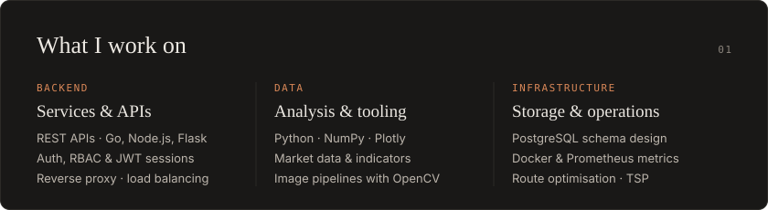
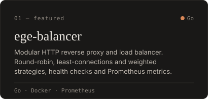
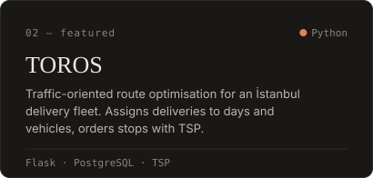
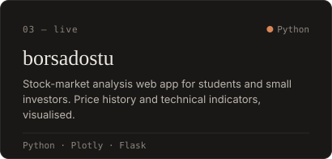
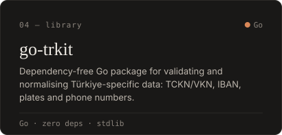
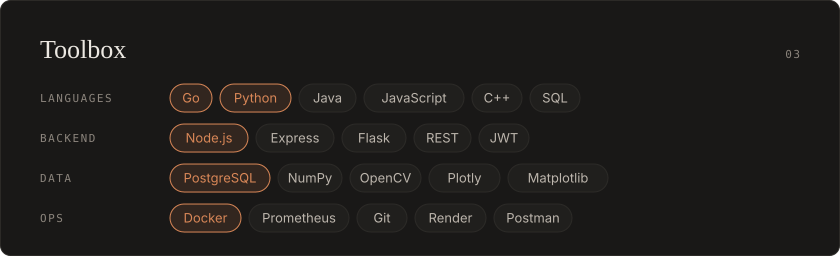
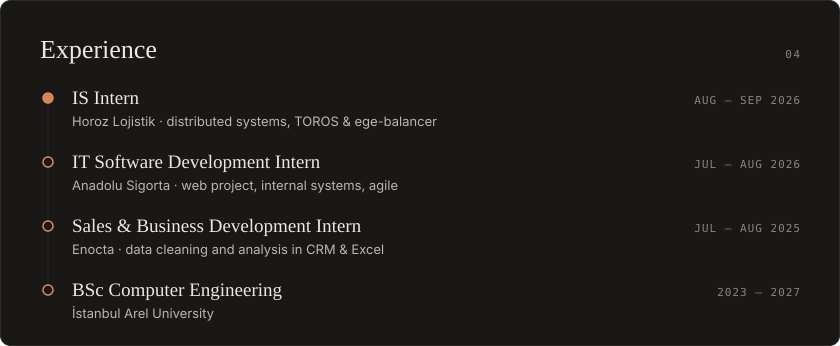

  
  
  
  

  <a href="https://berkegemenoguz.com">berkegemenoguz.com</a> &nbsp;·&nbsp;
  <a href="https://linkedin.com/in/berkegeoguz">LinkedIn</a> &nbsp;·&nbsp;
  <a href="https://borsadostu.com">borsadostu.com</a> &nbsp;·&nbsp;
  <a href="mailto:berkegemenoguz@hotmail.com">berkegemenoguz@hotmail.com</a>

